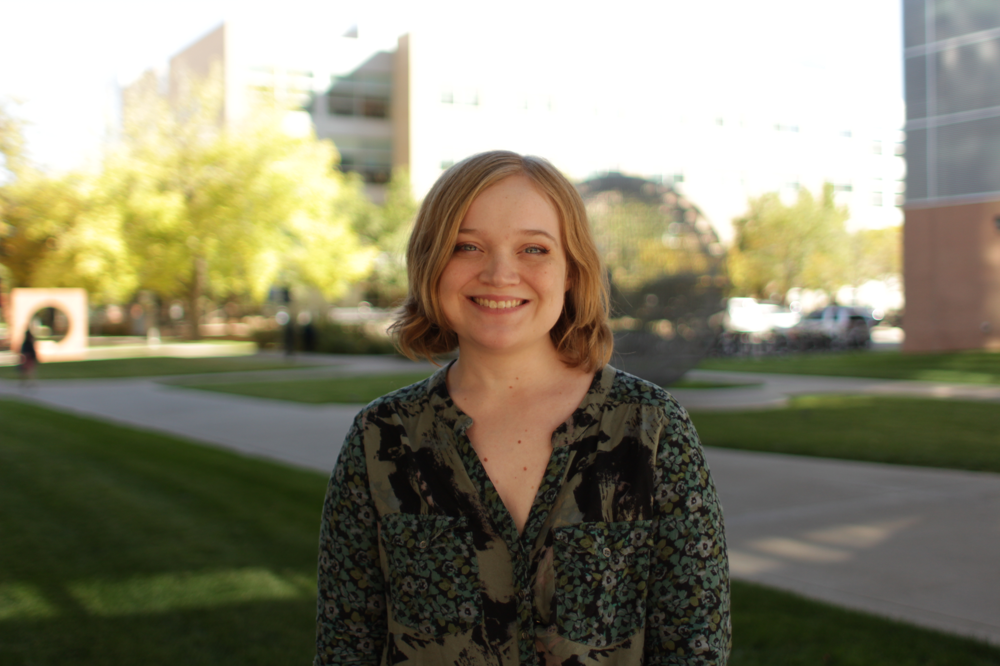

## Hi there 👋

My name is Kat, I'm a PhD Student at CU Anschutz. 
- **I'm broadly interested in:** microbiology, microbiomes, microbe-microbe interactions, and microbe-host interactions.
- **I'm currently working on:** building computational tools for microbiologists:
  - In my first rotation with the [JRavi Lab](https://github.com/JRaviLab), I built supervised machine learning models to predict antimicrobial resistance using k-mers
- **I'm learning:** how to build R packages, best practices for data science and software development, and how to build computational experiments!

